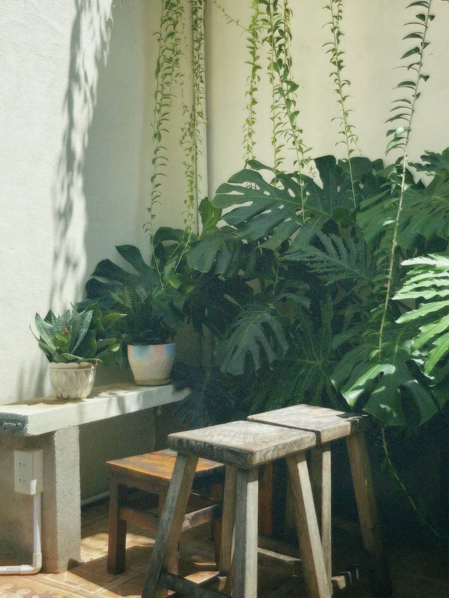

# Aframe Project - LMC 2700 Fall 2024
Created by svaryani3 and adi2781 on GitHub. This project is hosted at https://adi2781.github.io/aframe_corner/
## Attributes
"Monstera plant" (https://skfb.ly/oMJ9U) by Nomeda Repsaite is licensed under Creative Commons Attribution (http://creativecommons.org/licenses/by/4.0/).
"Monstera B02" (https://skfb.ly/oCVnS) by MozzarellaARC is licensed under Creative Commons Attribution (http://creativecommons.org/licenses/by/4.0/).
https://www.flickr.com/photos/126296198@N03/18753004390/in/photostream/
## Source
This project is based on this image found on Pinterest (link broken)
  